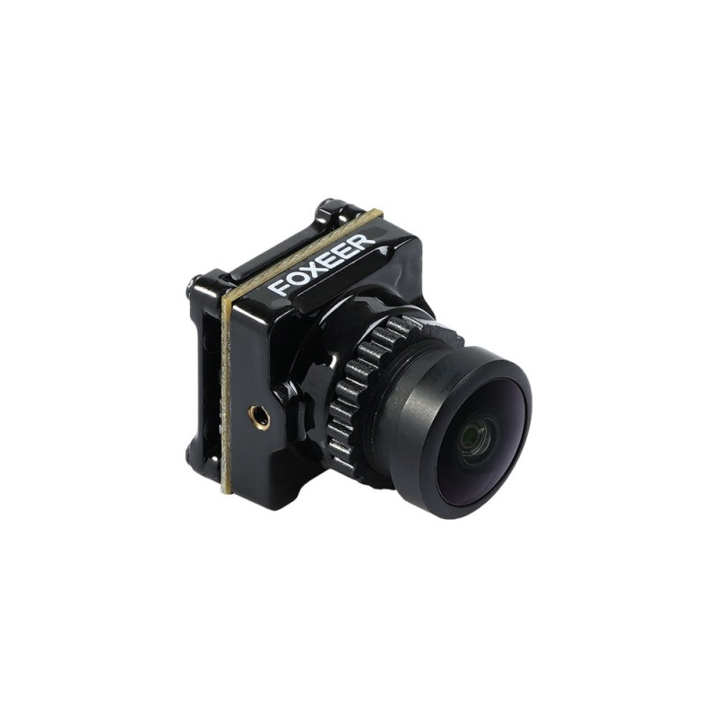

# Камеры

### TL:DR


Все камеры совместимы с передатчиками Air Unit и Caddx Vista (Runcam Link)


Если нужно что-то из списка ниже:

1. 1080p
2. 60/120 фпс
3. 16:9/4:3
4. настройки камеры из очков
   1. баланс белого
   2. поворот картинки

### Основные камеры:


1080p

60/120 фпс

16:9/4:3

доступны все настройки


#### DJI Camera

#### Caddx Nebula pro

#### Caddx Nebula nano pro

#### Caddx Air Unit Micro camera

.jpg>)

#### Runcam Falcon nano

### Камеры для целевых условий:


Для полётов при недостаточном освещении (сумерки, темные помещения)

720p

60 фпс

16:9

настройки из очков недоступны


#### Caddx Polar Starlight&#x20;

#### Caddx Polar Nano Starlight

#### Foxeer Apollo

