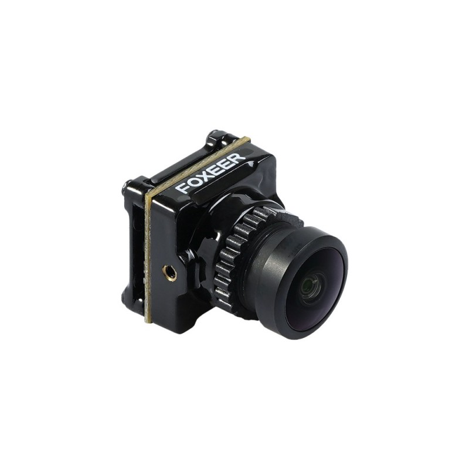

# Камеры


Все камеры совместимы с передатчиками Air Unit и Caddx Vista (Runcam Link)


## Основные

Камеры с наиболее широким спектром возможностей и настроек

1. 1080p
2. 60/120 фпс
3. 16:9/4:3
4. настройки камеры из очков

[DJI Camera](cameras.md#dji-camera)

[Caddx Nebula pro](cameras.md#caddx-nebula-pro)

[Caddx Nebula nano pro](cameras.md#caddx-nebula-nano-pro) (для мелких вупов)

[Caddx Air Unit Micro camera](cameras.md#caddx-air-unit-micro-camera)

[Runcam Falcon nano](cameras.md#runcam-falcon-nano)

## Дополнительные

Камеры для полётов при недостатке освещения:

* 720p
* 60 фпс
* 16:9
* нет функции настройки камеры из очков

[Caddx Polar Starlight](cameras.md#caddx-polar-starlight)

[Caddx Polar Nano Starlight](cameras.md#caddx-polar-nano-starlight)

[Foxeer Apollo](cameras.md#foxeer-apollo)

## Split камера


Подключается к передатчику, может писать на себя до 2.7к с гироданными


[RunCam Split HD](cameras.md#runcam-split-hd)

## Подробно

#### DJI Camera

|               |                                                      |
| ------------- | ---------------------------------------------------: |
| матрица:      | 
1/3.2-дюймовая CMOS;

эфф. пикселей 4Млн
 |
| разрешение:   |    720p/1080[\*](vtx.md#air-unit)p при 60/120 кадр/с |
| объектив:     |                                         2.1мм; f/2.1 |
| aspect ratio: |                                            4:3, 16:9 |
| FOV:          |                             150°(д); 122°(г); 93°(в) |
| ISO:          |                                          100 — 25600 |
| размеры:      |                                22.1 × 21.1 × 20.1 мм |
| вес:          |                                                8.2 г |

#### Caddx Nebula pro

|               |                                                   |
| ------------- | ------------------------------------------------: |
| матрица:      |                                 1/3-дюймовая CMOS |
| разрешение:   | 720p/1080[\*](vtx.md#air-unit)p при 60/120 кадр/с |
| объектив:     |                                      2.1мм; f/2.1 |
| aspect ratio: |                                         4:3, 16:9 |
| FOV:          |                          150°(д); 122°(г); 93°(в) |
| ISO:          |                                               n/a |
| размеры:      |                                   19 × 19 × 20 мм |
| вес:          |                                               6 г |

#### Caddx Nebula nano pro

|               |                                                   |
| ------------- | ------------------------------------------------: |
| матрица:      |                                 1/3-дюймовая CMOS |
| разрешение:   | 720p/1080[\*](vtx.md#air-unit)p при 60/120 кадр/с |
| объектив:     |                                      2.0мм; f/2.0 |
| aspect ratio: |                                         4:3, 16:9 |
| FOV:          |                          150°(д); 122°(г); 93°(в) |
| ISO:          |                                               n/a |
| размеры:      |                                 16.5 × 16 × 14 мм |
| вес:          |                                             3.5 г |

#### Caddx Air Unit Micro cameras

|               |                                                      |
| ------------- | ---------------------------------------------------: |
| матрица:      | 
1/3.2-дюймовая CMOS;

эфф. пикселей 4Млн
 |
| разрешение:   |    720p/1080[\*](vtx.md#air-unit)p при 60/120 кадр/с |
| объектив:     |                                         2.1мм; f/2.1 |
| aspect ratio: |                                            4:3, 16:9 |
| FOV:          |                             150°(д); 122°(г); 93°(в) |
| ISO:          |                                          100 — 25600 |
| размеры:      |                                    20.7 × 19 × 19 мм |
| вес:          |                                                  n/a |

#### Runcam Falcon nano

|               |                                                   |
| ------------- | ------------------------------------------------: |
| матрица:      |                               1/3.2-дюймовая CMOS |
| разрешение:   | 720p/1080[\*](vtx.md#air-unit)p при 60/120 кадр/с |
| объектив:     |                                      2.0мм; f/2.0 |
| aspect ratio: |                                         4:3, 16:9 |
| FOV:          |                          150°(д); 118°(г); 87°(в) |
| ISO:          |                                               n/a |
| размеры:      |                                   16 × 14 × 17 мм |
| вес:          |                                               4 г |

#### Caddx Polar Starlight&#x20;

|                    |                                          |
| ------------------ | ---------------------------------------: |
| матрица:           | 1/1.8 - inch HD Digital Starlight Sensor |
| разрешение:        |                           720p 60 кадр/с |
| объектив:          |                             1.6мм; f/1.6 |
| aspect ratio:      |                                     16:9 |
| FOV:               |                 162°(д); 138°(г); 75°(в) |
| min. illumination: |                              0.00003 Lux |
| размеры:           |                          24 × 19 × 19 мм |
| вес:               |                                      9 г |

#### Caddx Polar Nano Starlight

|                    |                                          |
| ------------------ | ---------------------------------------: |
| матрица:           | 1/1.8 - inch HD Digital Starlight Sensor |
| разрешение:        |                           720p 60 кадр/с |
| объектив:          |                             1.8мм; f/1.8 |
| aspect ratio:      |                                     16:9 |
| FOV:               |                 162°(д); 138°(г); 75°(в) |
| min. illumination: |                              0.00003 Lux |
| размеры:           |                        15.8 × 14 × 14 мм |
| вес:               |                                    2.7 г |

#### Foxeer Apollo

|                    |                                             |
| ------------------ | ------------------------------------------: |
| матрица:           |                       Sony 1/2" CMOS Sensor |
| разрешение:        |                              720p 60 кадр/с |
| объектив:          |                                         n/a |
| aspect ratio:      |                                        16:9 |
| FOV:               | 
Standard: 160°

Starlight: 170°
 |
| min. illumination: |                                 0.00001 Lux |
| размеры:           |                           22.7 × 19 × 19 мм |
| вес:               |                                       9.8 г |

#### RunCam Split HD

|                               |                                                              |
| ----------------------------- | -----------------------------------------------------------: |
| матрица:                      |                                                    SONY(5MP) |
| разрешение (запись):          | 
2.7K@60fps/2.7K@60fps(4:3) 1440P@60fps/1080P@60fps
 |
| разрешение (передача в очки): |                                               720p 60 кадр/с |
| объектив:                     |                                                          n/a |
| aspect ratio:                 |                                                         16:9 |
| FOV:                          |                                                         154° |
| размеры:                      |                                                   19 × 19 мм |
| вес:                          |                                                       19.9 г |

