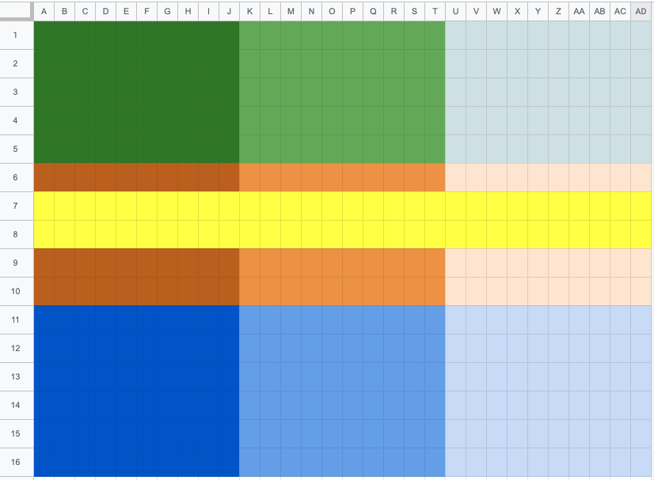

# Установка Fake\_HD

|            В конфигураторе           |                                   В очках                                   |
| :----------------------------------: | :-------------------------------------------------------------------------: |
|  |  |
|                                      |                                                                             |
|                                      |                                                                             |

Подключаем очки к веб конфигуратору WFTOS

Переходим во вкладку консоли CLI

Вводим (либо копируем-вставляем) по одной следующие команды. После ввода каждой команды жмём "ввод":


```
package-config set msp-osd fakehd_enable true
package-config apply msp-osd
```


_Опционально:_ расположите альтернативные шрифты в корень sd-карты очков, используя имена font\_bf\_hd.bin / font\_bf\_hd\_2.bin

Сторонние шрифты можно поискать по ссылкам ниже:&#x20;

* [Knifa/material-osd](https://github.com/Knifa/material-osd/releases)&#x20;
* [Shannon Baker](https://drive.google.com/drive/folders/1buxrXqhU46AxE3fwaFDsMb97IiGLVa95)
* [Sneaky FPV's Sphere for Betaflight](https://drive.google.com/file/d/1f7CBK9DV-8EYc\_Xt7IezKdUaECgADdUw/view)
* [VICEWIZE Italic](https://github.com/vicewize/vicewizeosdfontset)
