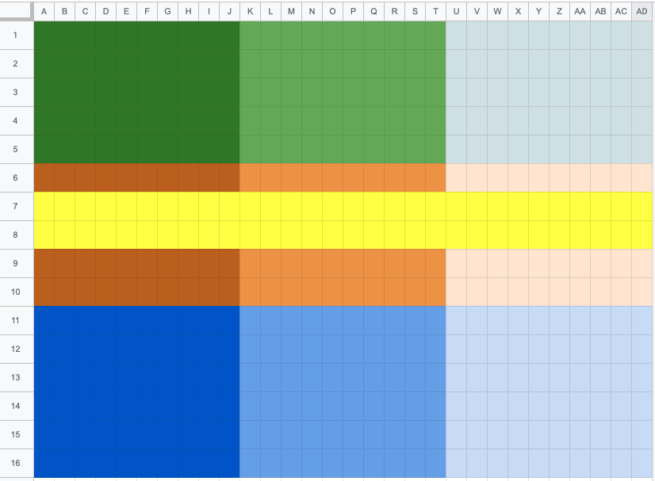

# Summary

### Дата обновления 07.12.2022

#### Совместимость

* Goggles 2:
  * O3 air unit
  * Air unit, caddx vista (runcam link) - прошивка тестируется ограниченным числом блогеров: есть «‎canvas» OSD, не надо переключаться между прошивками, очевидно - ломает root и wtfOS, в общем доступе пока нет
  * DJI Avata
* O3 air unit:
  * Goggles 2
  * FPV Goggles v2 - не без косяков, каждый раз, переключаясь между O3 и первым поколением передатчиков слетает бинд
  * ~~FPV Goggles v1~~ - был слух что будет совместимость через wtfOS, но разраб это опроверг
    * 
  * DJI FPV Goggles 2
    * DJI FPV Drone (толстый)
    * DJI Avata
    * O3 air unit
    * Air unit, caddx vista (runcam link)
      * очки могут сохранить возможность работы и с O3 юнитом, и с рутованными юнитами первого поколения (со всеми плюсами wtfOS) - обновляйтесь внимательно, следите за новостями fpv.wtf

#### Хорошие (или почти хорошие) моменты:

* O3 air unit имеет «‎canvas» OSD из коробки
  * это не полноценный канвас, просто ограниченная сетка символов
    * goggles 2 пишут всё OSD на видео
    * FPV goggles v2 - не пишут его на видео и в SRT пишут всё тот же ограниченный набор параметров
    * не работает на inav
      * хотя это проблемы inav, всё работает на betaflight (4.3), kiss и ardupilot
    * новая прошивка первого поколения юнитов добавляет в них точно такой же «‎canvas»
* Лимит точно больше 20км
* Глобальных проблем с перегревом (как пытались шутить изначально) - нет
  * O3 юнит потребляет на 40% больше энергии, поэтому время отсечки по температуре на столе - кратно меньше, чем у висты по замерам Chris Rosser:
    * O3 юнит \~3:13
    * caddx vista \~5:13
    * в low power mode время до отключения в 2 с небольшим раза дольше

#### Заключение обычных людей из хобби на сегодня:

* O3 aur unit по картинке это лучшее, что есть на рынке
* у новых очков есть проблема с эргономикой
  * куда меньше шансов что очки хорошо «‎сядут»
    * по удобству расположения на голове
    * по FOV вообще
    * по чёткости картинки на всей её площади
* FPV goggles v2 остаются отличным вариантом:
  * совместимость со всем парком железа от DJI
    * с сохранением рута и всех его плюшек
  * ниже задержка (из-за большей частоты обновления дисплеев)
  * кол-во аксессуаров (в том числе антенн)
  * минус - слетающий бинд при переключении между поколениями:
    * вероятно, проблема решится _**если**_ DJI выпустят прошивку «‎всё в одном» аналогично Goggles 2 (что, скорее всего, лишит возможности работы с wtfOS)

