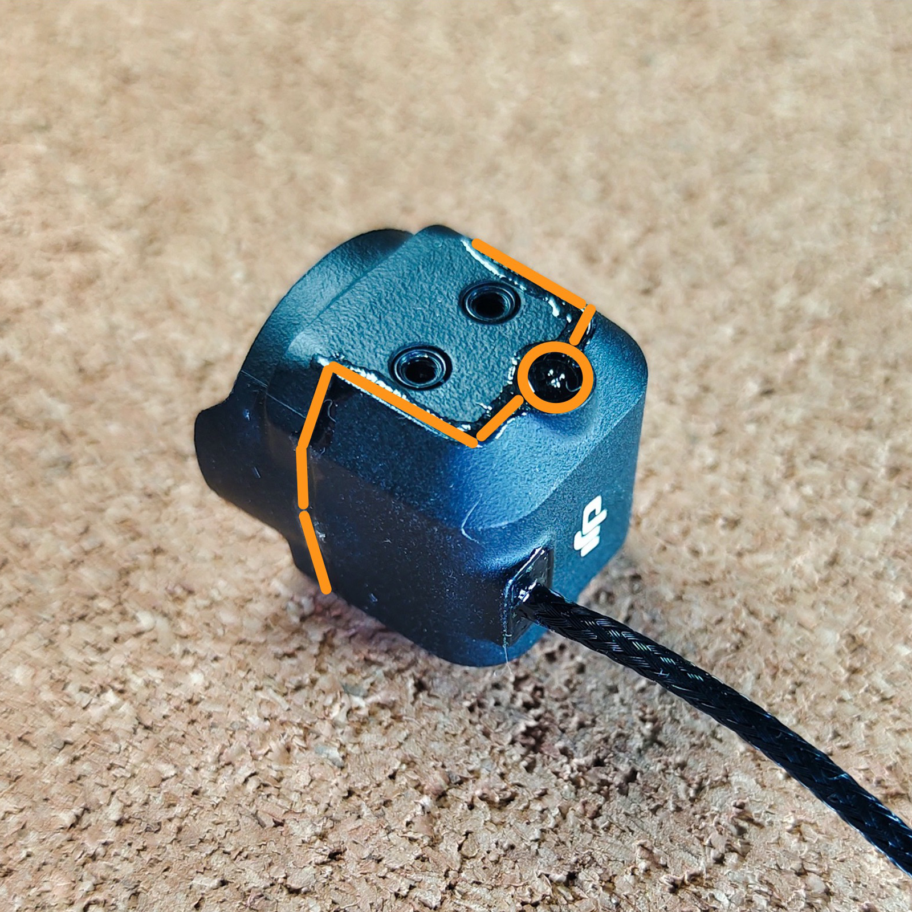
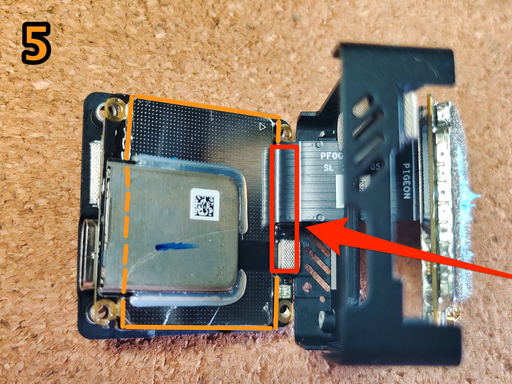

# ☔ O3 air unit. Защита от влаги

По материалам канала [SHTARK FPV](https://t.me/shtarkfpv/64)


Все манипуляции вы делаете на свой страх и риск, под личную ответственность


Идеально загерметить О3 не получится, т.к, unit сильно греется (ему нужно охлаждаться) + есть коннекторы, в которые недопустимо попадание клея.

В данном примере использовался B7000.

## o3 камера

#### Шаг 1

Нанести тонкий слой по соединительному контуру крышки камеры.

<figure><figcaption>
Шаг 1.1
</figcaption></figure>

<figure><figcaption>
Шаг 1.2
</figcaption></figure>

#### Шаг 2

Нанести тонкий слой по контуру линзы объектива, так как там сквозная щель, идущая до платы камеры. И которая со временем станет «пыле-влаго-сборником».

<figure><figcaption>
Шаг 2
</figcaption></figure>

## o3 unit

#### Шаг 3

Если снять обе крышки с unit'a, то можно, аккуратно отогнув шлейф на 90 градусов, получить доступ к платам.


Все манипуляции со шлейфом нужно делать максимально осторожно!


<figure><figcaption>
Шаг 3
</figcaption></figure>

#### Шаг 4

Нанести небольшое количество по контуру изолирующей крышки.


Выделено красным - не допускать попадания на коннектор камеры!


<figure><figcaption>
Шаг 4
</figcaption></figure>

#### Шаг 5

Нанести небольшое количество по контуру изолирующей крышки и под слотом SD карты (выделено пунктиром).


С этой стороны платы не допускать попадания в SD-слот, а также <mark style="background-color:red;">не покрывать</mark> область - где оба коннектора (помечено красным).


<figure><figcaption>
Шаг 5
</figcaption></figure>

#### Шаг 6


Перед следующими действиями - лучше дать один час просохнуть первой плате, чтобы не приклеивалась к корпусу, т.к. необходимо сдвинуть корпус по шлейфу для доступа ко второй плате.


Верхняя часть радиомодуля покрывается просто по контуру.


Не допускайте попадание герметика в антенные u.fl коннекторы!


<figure><figcaption>
Шаг 6
</figcaption></figure>

#### Шаг 7

Нижняя часть радиомодуля покрывается также по контурам крышек, исключая область межплатного шлейфа.


Не покрывать область где подключается межплатный шлейф (помечено красным).


<figure><figcaption>
Шаг 7
</figcaption></figure>


Отсутствующая на фото наклейка - снимается легко пинцетом, и также легко ставится на место после высыхания герметика.


Дать высохнуть в открытом состоянии пару часов и можно собирать
